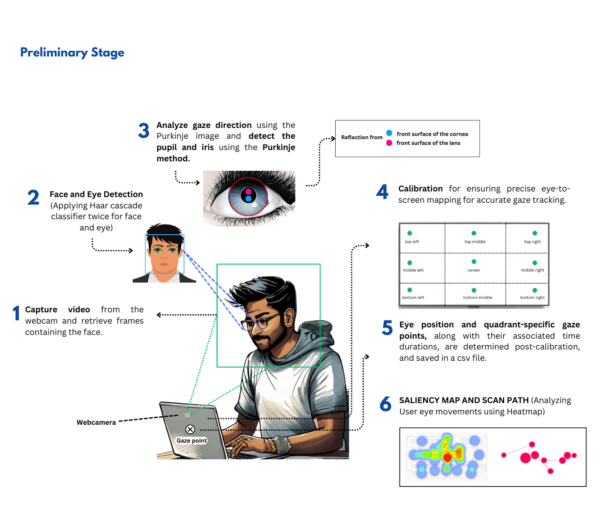
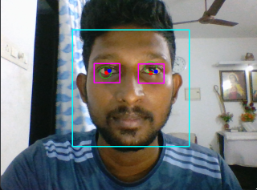
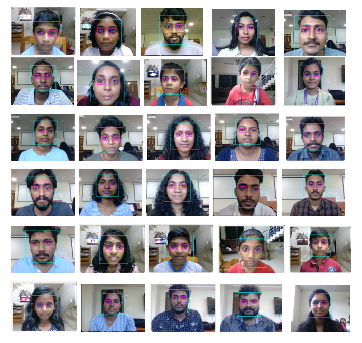

# 👁️ Realtime Eye Tracking and Gaze Estimator

Welcome to the **Realtime Eye Tracking and Gaze Estimator**, a computer vision project that uses webcam input and Haar cascade classifiers to detect eye movements, estimate gaze vectors, and generate real-time heatmaps over target images.

<div align="center">
  
</div>

---

## 🔍 Features

- 👨‍💻 **Fa Eye Detection** using Haar cascades.
- 🎯 **Pupil, Iris, and Purkinje Image Detection** for accurate gaze vector estimation.
- 🧠 **Gaze Vector Calibration** for mapping to screen coordinates.
- 🖱️ **Pointer Control** on screen via gaze direction.
- 🌡️ **Gaze Heatmap Overlay** on input images.
- 📊 **Gaze Region Analysis** visualized via bar charts.

---

## 🖼️ Visual Output

**Real-Time Gaze Tracking**
> Green dot = Estimated Gaze | Red dot = Pupil Center | Blue dot = Purkinje Reflection



**Testing**
> Eye tracking tested on different individuals.



---

## 🧠 How it Works

1. Capture webcam input using OpenCV.
2. Detect face and eye regions using Haar cascades.
3. Analyze eyes to detect:
   - Pupil center
   - Iris boundary
   - Purkinje reflections
4. Estimate gaze vector from eye geometry.
5. Map gaze to screen or image coordinates.
6. Collect gaze points over time and render heatmaps using Gaussian masks.

---

## 🚀 Getting Started

### Prerequisites

- Python 3.7+
- OpenCV
- NumPy
- PyAutoGUI
- Matplotlib
- Seaborn
- tqdm
- scikit-learn

### Installation

```bash
pip install -r requirements.txt
```

> **Note:** Make sure the `classifiers/` folder contains the required Haar cascade XML files.

### Running the Application

```bash
python main.py
```

The app will open the webcam, start detecting gaze, and show a control window. Press:
- `c` to start calibration
- `ESC` to exit

---

## 📁 Project Structure

```plaintext
.
├── classifiers/
│   ├── haarcascade_frontalface_default.xml
│   └── haarcascade_eye_tree_eyeglasses.xml
├── eye_tracker.py
├── gaze_tracker.py
├── model.py
├── screen.py
├── calibration.py
── main.py
├── images/
│   ├── demo.png
│   ├── architecture.png
│   └── test.png
└── README.md
```

---

## 📌 Calibration Info

Calibration maps raw gaze vectors to specific screen regions. You can trigger this proces any time during execution by pressing `c`. Calibration is essential for proper gaze-to-screen mapping.

---

## 🤝 Contributing

Contributions are welcome! Fork the repo improve it, and open a pull request. Suggestions and bug reports are appreciated.

---

## 📜 License

MIT License – feel free to use and modify!

---

## 🙏 Acknowledgements

- Haar Cascade Classifiers by OpenCV.
- Gaze mapping inspired by human-computer interaction (HCI) principles.
- Open source libraries: OpenCV, PyAutoGUI, Seaborn, Matplotlib.

---

Stay focus, stay sharp 👁️  
Happy Gaze Tracking!


